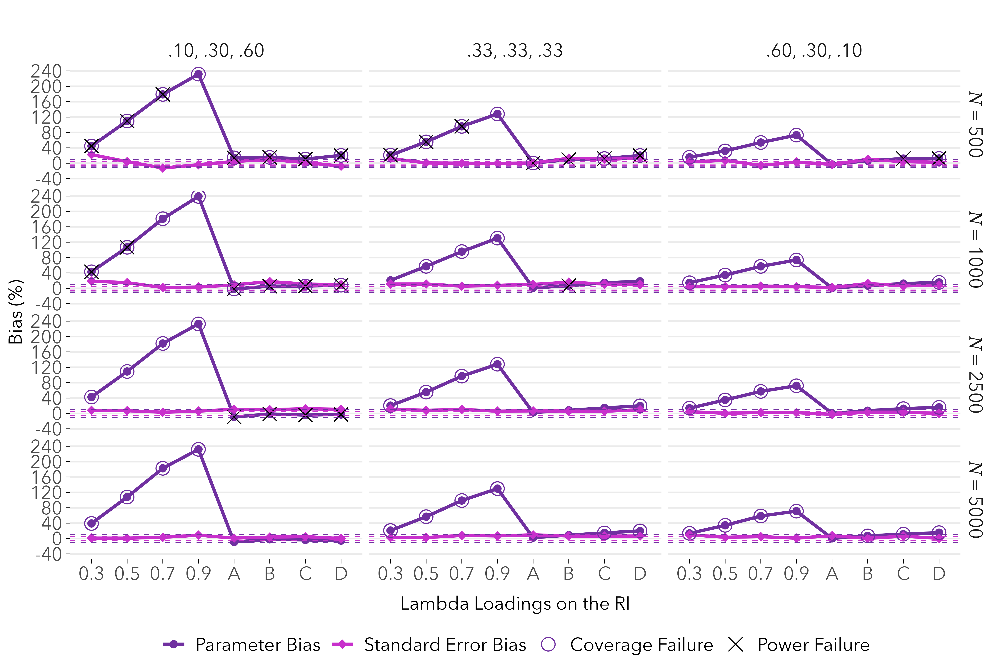

# RILTA Simulation Study  
*Monte Carlo Simulations for Random Intercepts Latent Transition Analysis*

**Author**: Delwin B. Carter, Ph.D.  
**Institution**: UC Santa Barbara — Department of Education (Quantitative Research Methods)

---

## 🧠 Overview

This repository contains the complete Monte Carlo simulation study for my Ph.D. dissertation. It evaluates the performance of **Random Intercepts Latent Transition Analysis (RI-LTA)** compared to standard LTA using `MplusAutomation`, under varying data conditions and time points.

- 🛠 **Tools**: R, Mplus, Quarto, MplusAutomation  
- 📈 **Scope**: 2- and 3-timepoint simulations, full factorial designs  
- 🗂 **Output**: Simulation files, figures, heatmaps, label-switching diagnostics, and formatted tables

---

## 🧰 Key Packages

```r
tidyverse      # Core data manipulation and visualization
MplusAutomation# Interface with Mplus for simulation control
here           # Project-agnostic file paths
gt, flextable  # Publication-ready tables
glue           # Dynamic strings
parallel       # Simulation parallelization
ggtext         # Enhanced ggplot labels
webshot2       # Image capture for Quarto/HTML
```

---

## 🧪 Simulation Design

The project contains two major simulation studies:

### 🔹 [Study 1](Simulations/STUDY_1/)
> *Simulation of three analytic pathways across 2 and 3 time points*  
> **Conditions**:  
> - LTA-generated → LTA-analyzed  
> - LTA-generated → RI-LTA-analyzed  
> - RI-LTA-generated → LTA-analyzed  

- ✅ 6 Quarto `.qmd` documents for 2T/3T
- ✅ 16 simulation folders (originals + replicates)
- ✅ Diagnostic outputs: Fit tables, convergence rates, label-switching plots
- 🔗 See all `.qmd` files and simulation folders [here](Simulations/STUDY_1/)


---

### 🔹 [Study 2](Simulations/STUDY_2/)
> *Simulation of LTA ↔ RI-LTA misalignment at 2 time points*  
> **Conditions**:
> - LTA-generated → LTA-analyzed  
> - LTA-generated → RI-LTA-analyzed  
> - RI-LTA-generated → LTA-analyzed  

- ✅ 6 Quarto `.qmd` documents  
- ✅ 6 simulation folders with replications
- 🔗 Explore Study 2 [here](Simulations/STUDY_2/)


---

## 🎨 Visual Outputs

Each study includes:
- 📊 **Figures**: Parameter bias, entropy, and convergence
- 🔥 **Heatmaps**: Fit index comparisons and classification accuracy
- 🚨 **Violator Plots**: Label switching and class collapse diagnostics

View folders like:  
[STUDY_1/zFIGURES/](Simulations/STUDY_1/2%20Time%20Points/zFIGURES/)  
[STUDY_1/zVIOLATOR_PLOTS/](Simulations/STUDY_1/2%20Time%20Points/zVIOLATOR_PLOTS/)

---

## 📄 Dissertation Reference

This project supports my dissertation:  
*Carter, D. (2025). Understanding the performance of random intercepts latent transition analysis (RI-LTA): A Monte Carlo simulation study using MplusAutomation.*  
University of California, Santa Barbara.

---

## 🧑‍💻 About Me

Ph.D. in Quantitative Research Methods • Data Scientist • Founder, The Mix Institute  
Specializing in mixture modeling, latent variable methods, and reproducible workflows.

---

## 📌 Status

- ✅ Core code, simulation design, and Quarto documents are complete  
- 🛠 Some folders and figures are still being finalized, cleaned, or added  
- 🧪 Representative outputs included; full polish and documentation in progress

---

## 🖼 Sample Figure: RI-LTA to LTA Bias (Study 2)

  
*Figure: Bias in transition probability estimates when RI-LTA-generated data is analyzed using LTA.  
Loading conditions (.3, .5, .7, .9, and pattern D) represent varying degrees of within-class homogeneity.  
Larger RI loadings (and Pattern D) produce greater model misspecification and bias.*

> Full sets of plots are available in each study’s `/zFigures/`, `/zHeatmaps/`, and `/zViolator_Plots/` folders.

---

## 🗂 Repo Navigation Tips

If folder links appear broken, copy-paste the full path into your browser or use the GitHub file tree. Space-sensitive paths (e.g., `3%20Time%20Points`) may break when clicked from some markdown renderers.
